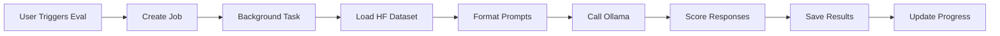

# SLM Evaluation Framework

<div align="center">


**A powerful, privacy-first evaluation framework for Small Language Models (SLMs)**

[Features](#-features) • [Quick Start](#-quick-start) • [Documentation](#-documentation) • [Contributing](#-contributing)

</div>

---

## 🎯 Overview

The **SLM Evaluation Framework** enables developers and researchers to rigorously benchmark local language models against real-world datasets—**without sending data to the cloud**. Built on Ollama for local inference and HuggingFace for research-grade datasets, this framework provides:

- 🔒 **Privacy-First**: All model inference happens locally on your hardware
- 📊 **Real Datasets**: Direct integration with HuggingFace's curated evaluation datasets
- 🧠 **Advanced Prompting**: Chain of Thought (CoT) + Few-Shot + Dynamic Templates
- ⚡ **Async Evaluation**: Non-blocking job processing with real-time progress tracking
- 📈 **Beautiful Analytics**: Glassmorphic UI with comparative model performance charts

---

## ✨ Features

### 🎨 **Modern UI**
- Glassmorphic design with Tailwind CSS v4
- Real-time progress tracking with smooth animations
- Responsive dashboard with Recharts visualizations

### 🔧 **Flexible Prompt Engineering**
- **Chain of Thought (CoT)**: Define reasoning methodology
- **Few-Shot Learning**: Provide concrete examples
- **Dynamic Templates**: Inject dataset fields at runtime with `{{placeholders}}`

### 🚀 **Production-Ready**
- Asynchronous job processing with `asyncio`
- Persistent evaluation history (JSON storage)
- RESTful API with automatic OpenAPI documentation
- Easy deployment with Docker support

### 📦 **Extensible Architecture**
- Add custom datasets from HuggingFace
- Create custom scoring functions
- Define new use cases via simple configuration

---

## 🚀 Quick Start

### Prerequisites

Before you begin, ensure you have:
- **Python 3.13+** ([Download](https://python.org))
- **Node.js 18+** ([Download](https://nodejs.org))
- **Ollama** ([Install Guide](https://ollama.ai))

### 1️⃣ Install Ollama

```bash
# macOS
brew install ollama

# Start Ollama service
ollama serve

# Pull a model (example)
ollama pull llama3.2:3b
```

### 2️⃣ Setup Backend

```bash
cd backend

# Create virtual environment
python -m venv venv
source venv/bin/activate  # On Windows: venv\Scripts\activate

# Install dependencies
pip install -r requirements.txt

# Start FastAPI server
python -m uvicorn main:app --reload
```

✅ Backend running at `http://localhost:8000`  
📚 API docs at `http://localhost:8000/docs`

### 3️⃣ Setup Frontend

```bash
cd slm-eval-app

# Install dependencies
npm install

# Start development server
npm run dev
```

✅ Frontend running at `http://localhost:5173`

### 4️⃣ Run Your First Evaluation

1. Open `http://localhost:5173` in your browser
2. Navigate to **Use Cases** → Select "General Knowledge Helper"
3. Click **Run Evaluation**
4. Choose a model (e.g., `llama3.2:3b`)
5. Select a prompt configuration
6. Watch real-time progress in the **Activity** tab
7. View results in the **Visualizer** tab

---

## 🛠 Tech Stack

### Backend
| Technology | Purpose |
|------------|---------|
| **FastAPI** | High-performance async web framework |
| **Ollama** | Local LLM inference engine |
| **HuggingFace Datasets** | Research-grade evaluation datasets |
| **httpx** | Async HTTP client for Ollama API |
| **Pydantic** | Data validation and serialization |

### Frontend
| Technology | Purpose |
|------------|---------|
| **React 18** | Component-based UI framework |
| **Vite** | Lightning-fast build tool |
| **Tailwind CSS v4** | Utility-first styling with glassmorphism |
| **Recharts** | Declarative charting library |
| **Framer Motion** | Production-ready animations |
| **Lucide React** | Modern icon library |

---

## 📂 Project Structure

```text
slm_eval_framework/
├── backend/
│   ├── main.py              # FastAPI app, evaluation logic, persistence
│   ├── requirements.txt     # Python dependencies
│   └── data/                # JSON storage (jobs.json, results.json)
├── slm-eval-app/
│   ├── src/
│   │   ├── pages/           # Dashboard, UseCases, Prompts, Results, etc.
│   │   ├── components/      # Reusable UI components
│   │   ├── App.jsx          # Routing and global state
│   │   ├── Layout.jsx       # Navigation shell
│   │   └── index.css        # Tailwind v4 configuration
│   ├── package.json
│   └── vite.config.js
├── README.md
└── context.md               # Project context for AI assistants
```

---

## 🧩 How It Works

### 1. **Three-Layer Prompt Construction**

```python
# Layer 1: Chain of Thought (System Instructions)
cot_content = """You are an expert reasoning assistant.
Follow these steps:
1. Analyze the question
2. Break down the reasoning
3. Provide the final answer"""

# Layer 2: Few-Shot Examples
few_shot_content = """Q: What is 2+2?
Reasoning: Add 2 and 2 together.
Answer: 4"""

# Layer 3: User Template (Dynamic)
user_template = "Question: {{question}}\nChoices: {{choices}}\nAnswer:"
```

### 2. **Async Evaluation Pipeline**



### 3. **Real-Time Progress Tracking**

The frontend polls `/jobs/{id}` every 2 seconds to display live progress bars and status updates.

---

## 📊 Use Cases

### General Knowledge Helper (GKH)
- **Dataset**: `allenai/ai2_arc` (ARC-Easy)
- **Samples**: 570 questions
- **Domain**: Common sense reasoning and scientific knowledge

### Code Generator (CG)
- **Dataset**: Custom or `openai/humaneval`
- **Domain**: Python code generation

### 🎯 Add Your Own Use Case

```python
UseCase(
    id="CUSTOM",
    name="Custom Use Case",
    description="Your custom evaluation scenario",
    dataset_count=100,
    dataset_source="hf:your_dataset:subset",
    prompts=[...]
)
```

---

## 🔍 Comparison with Alternatives

| Feature | SLM Eval Framework | LangSmith | PromptFoo | OpenAI Evals |
|---------|-------------------|-----------|-----------|--------------|
| **Local Execution** | ✅ Yes | ❌ Cloud-only | ✅ Yes | ❌ Cloud-only |
| **HuggingFace Integration** | ✅ Native | ⚠️ Manual | ⚠️ Manual | ❌ No |
| **Prompt Engineering UI** | ✅ Full editor | ⚠️ Basic | ✅ Yes | ❌ Code-only |
| **Real-Time Progress** | ✅ Yes | ✅ Yes | ❌ No | ❌ No |
| **Cost** | 🆓 Free | 💰 Paid | 🆓 Free | 💰 API costs |
| **Privacy** | 🔒 100% Local | ⚠️ Cloud | 🔒 Local | ⚠️ Cloud |

---

## 🐛 Troubleshooting

### Ollama Connection Failed

**Error**: `Connection refused to localhost:11434`

**Solution**:
```bash
# Check if Ollama is running
curl http://localhost:11434/api/tags

# If not, start Ollama
ollama serve
```

### Dataset Download Timeout

**Error**: `Timeout downloading dataset from HuggingFace`

**Solution**: Increase timeout in `backend/main.py`:
```python
ds = load_dataset(dataset_name, config, split='validation', 
                  trust_remote_code=True, download_timeout=300)
```

### Frontend CORS Error

**Error**: `CORS policy blocked request`

**Solution**: Ensure backend CORS is configured in `backend/main.py`:
```python
app.add_middleware(
    CORSMiddleware,
    allow_origins=["http://localhost:5173"],
    allow_credentials=True,
    allow_methods=["*"],
    allow_headers=["*"],
)
```

### Model Not Found

**Error**: `Model 'xyz' not found`

**Solution**: Pull the model first:
```bash
ollama pull llama3.2:3b
```

---

## 🗺 Roadmap

### Short-Term (v1.1)
- [ ] Multi-metric evaluation (F1, precision, recall, BLEU)
- [ ] Prompt versioning and history
- [ ] CSV/Excel export for results
- [ ] Side-by-side model comparison view
- [ ] Detailed error analysis dashboard

### Medium-Term (v1.5)
- [ ] PostgreSQL support for production deployments
- [ ] User authentication and role-based access
- [ ] Docker Compose deployment
- [ ] Custom dataset upload via UI
- [ ] Automated scheduled evaluations

### Long-Term (v2.0)
- [ ] Distributed evaluation (multi-GPU/multi-node)
- [ ] Fine-tuning integration and tracking
- [ ] Public/private benchmark leaderboards
- [ ] Plugin system for community contributions
- [ ] Enterprise features (audit logs, compliance)

---

## 🤝 Contributing

We welcome contributions! Here's how you can help:

### Reporting Bugs
- Use the [GitHub Issues](https://github.com/yourusername/slm_eval_framework/issues) page
- Include steps to reproduce, expected vs actual behavior
- Provide system info (OS, Python version, Ollama version)

### Suggesting Features
- Open a [Feature Request](https://github.com/yourusername/slm_eval_framework/issues/new?template=feature_request.md)
- Describe the use case and expected behavior
- Explain why this feature would be valuable

### Pull Requests
1. Fork the repository
2. Create a feature branch (`git checkout -b feat/amazing-feature`)
3. Make your changes with clear commit messages
4. Add tests for new functionality
5. Update documentation (README, docstrings)
6. Submit a PR with a clear description

### Code Style
- **Backend**: Follow PEP 8, use `black` for formatting
- **Frontend**: Use ESLint + Prettier with Airbnb config
- **Commits**: Use [Conventional Commits](https://www.conventionalcommits.org/) (`feat:`, `fix:`, `docs:`)

---

## 📄 License

This project is licensed under the **MIT License** - see the [LICENSE](LICENSE) file for details.

### What This Means
- ✅ Commercial use allowed
- ✅ Modification allowed
- ✅ Distribution allowed
- ✅ Private use allowed
- ⚠️ No warranty provided
- ⚠️ No liability accepted

---

## 🙏 Acknowledgments

This project builds on the excellent work of:
- [Ollama](https://ollama.ai) - Local LLM inference
- [HuggingFace](https://huggingface.co) - Datasets and model hub
- [FastAPI](https://fastapi.tiangolo.com) - Modern Python web framework
- [React](https://react.dev) - UI component library
- [Tailwind CSS](https://tailwindcss.com) - Utility-first CSS framework

Special thanks to the open-source community for making tools like this possible! 🚀

---

## 📚 Documentation

For detailed technical documentation, see:
- **[Comprehensive Technical Overview](./SLM_Evaluation_Framework_Comprehensive_Writeup.md)** - In-depth architecture and implementation guide
- **[API Documentation](http://localhost:8000/docs)** - Interactive OpenAPI docs (when backend is running)
- **[Context Guide](./context.md)** - Quick reference for AI assistants

---

## 📧 Contact & Support

- **Issues**: [GitHub Issues](https://github.com/yourusername/slm_eval_framework/issues)
- **Discussions**: [GitHub Discussions](https://github.com/yourusername/slm_eval_framework/discussions)
- **Email**: your.email@example.com

---

<div align="center">

**Made with ❤️ for the open-source AI community**

⭐ **Star this repo** if you find it useful!

[Report Bug](https://github.com/yourusername/slm_eval_framework/issues) • [Request Feature](https://github.com/yourusername/slm_eval_framework/issues) • [Contribute](CONTRIBUTING.md)

</div>
